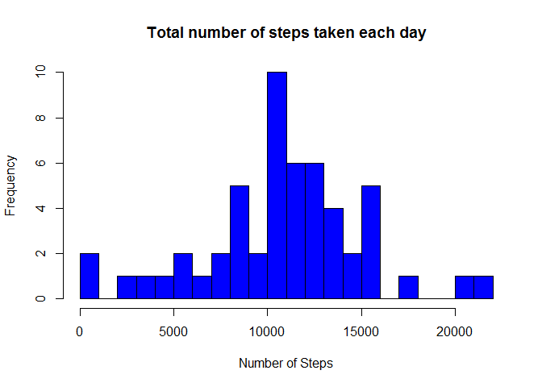
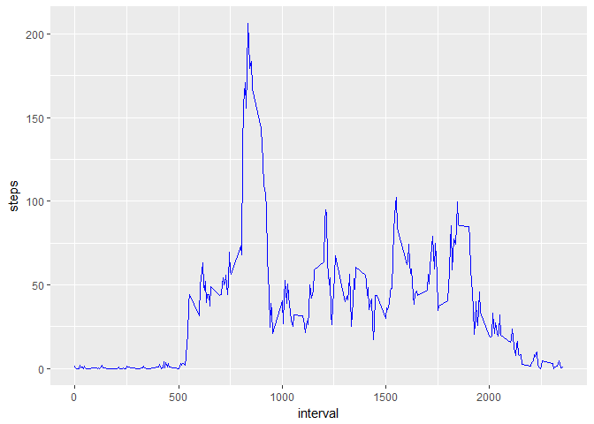
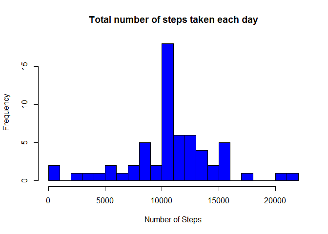

# Reproducible Research: Peer Assessment 1
Eeva Rasi  
8th October 2017  


## Background

It is now possible to collect a large amount of data about personal movement using activity monitoring devices such as a Fitbit, Nike Fuelband, or Jawbone Up. These type of devices are part of the "quantified self" movement - a group of enthusiasts who take measurements about themselves regularly to improve their health, to find patterns in their behavior, or because they are tech geeks. But these data remain under-utilized both because the raw data are hard to obtain and there is a lack of statistical methods and software for processing and interpreting the data.

This assignment makes use of data from a personal activity monitoring device. This device collects data at 5 minute intervals through out the day. The data consists of two months of data from an anonymous individual collected during the months of October and November, 2012 and include the number of steps taken in 5 minute intervals each day.

The data for this assignment is downloaded from the course web site:

https://d396qusza40orc.cloudfront.net/repdata%2Fdata%2Factivity.zip

The variables included in this dataset are:

- steps: Number of steps taking in a 5-minute interval (missing values are coded as NA)
- date: The date on which the measurement was taken in YYYY-MM-DD format
- interval: Identifier for the 5-minute interval in which measurement was taken

The dataset is stored in a comma-separated-value (CSV) file and there are a total of 17,568 observations in this dataset.


## Loading and preprocessing the data


```r
## Needed libraries
require(knitr)
require(ggplot2)
require(dplyr)
require(scales)
require(timeDate)

## Loading and preprocessing the data
url_training <- "https://d396qusza40orc.cloudfront.net/repdata%2Fdata%2Factivity.zip"
download.file(url_training, destfile="activity.zip")
unzip(zipfile="activity.zip")

activity_data = read.csv("activity.csv", colClasses = c(date = "Date"))
```
## What is mean total number of steps taken per day?

1. Calculate the total number of steps taken per day


```r
# Calculate the total number of steps taken per day
steps_per_day <- activity_data %>%
  group_by(date) %>%
  summarize(steps = sum(steps))

steps_per_day
```

```
## # A tibble: 61 x 2
##          date steps
##        <date> <int>
##  1 2012-10-01    NA
##  2 2012-10-02   126
##  3 2012-10-03 11352
##  4 2012-10-04 12116
##  5 2012-10-05 13294
##  6 2012-10-06 15420
##  7 2012-10-07 11015
##  8 2012-10-08    NA
##  9 2012-10-09 12811
## 10 2012-10-10  9900
## # ... with 51 more rows
```


2. Make a histogram of the total number of steps taken each day

<!-- -->

3. Calculate and report the mean and median of the total number of steps taken per day


```r
mean_steps <- mean(steps_per_day$steps, na.rm=TRUE)
median_steps <- median(steps_per_day$steps, na.rm=TRUE)

# The mean of the total number of steps taken per day
mean_steps
```

```
## [1] 10766.19
```

```r
# The median of the total number of steps taken per day
median_steps
```

```
## [1] 10765
```

## What is the average daily activity pattern?

1. Make a time series plot (i.e. type = "l") of the 5-minute interval (x-axis) and the average number of steps taken, averaged across all days (y-axis)


```r
interval_data <- activity_data %>%
  filter(!is.na(steps)) %>%
  group_by(interval) %>%
  summarize(steps = mean(steps))
  
ggplot(interval_data, aes(x=interval, y=steps)) + geom_line(color = "blue")
```

<!-- -->

2. Which 5-minute interval, on average across all the days in the dataset, contains the maximum number of steps?


```r
interval_data[which.max(interval_data$steps),]
```

```
## # A tibble: 1 x 2
##   interval    steps
##      <int>    <dbl>
## 1      835 206.1698
```

## Imputing missing values

1. Calculate and report the total number of missing values in the dataset (i.e. the total number of rows with NAs)


```r
# 1. Calculate and report the total number of missing values in the dataset (i.e. the total number of rows with NAs)
sum(is.na(activity_data$steps))
```

```
## [1] 2304
```

2. Devise a strategy for filling in all of the missing values in the dataset. The strategy does not need to be sophisticated. For example, you could use the mean/median for that day, or the mean for that 5-minute interval, etc.

3. Create a new dataset that is equal to the original dataset but with the missing data filled in.


```r
# Create a new dataset 
data_new <- activity_data

# Replace NA values with mean for the 5-minute interval
naVar <- is.na(data_new$steps)
avgValue <- tapply(data_new$steps, data_new$interval, mean, na.rm=TRUE, simplify=TRUE)
data_new$steps[naVar] <- avgValue[as.character(data_new$interval[naVar])]
```


4. Make a histogram of the total number of steps taken each day and Calculate and report the mean and median total number of steps taken per day. Do these values differ from the estimates from the first part of the assignment? What is the impact of imputing missing data on the estimates of the total daily number of steps?


```r
steps_per_day2 <- data_new %>%
  filter(!is.na(steps)) %>%
  group_by(date) %>%
  summarize(steps = sum(steps))
 
# Make a histogram of the total number of steps taken each day
hist(steps_per_day2$steps, main = "Total number of steps taken each day", col="blue", xlab="Number of Steps", breaks=20)
```

<!-- -->


```r
mean_steps2 <- mean(steps_per_day2$steps)
median_steps2 <- median(steps_per_day2$steps)

# The mean of the total number of steps taken per day
mean_steps2
```

```
## [1] 10766.19
```

```r
# The median of the total number of steps taken per day
median_steps2
```

```
## [1] 10766.19
```

We can see that the mean value remains the same and the median becomes equal to mean.

## Are there differences in activity patterns between weekdays and weekends?

1. Create a new factor variable in the dataset with two levels - "weekday" and "weekend" indicating whether a given date is a weekday or weekend day.


```r
# Create a new factor variable in the dataset with two levels - "weekday" and "weekend" 

data_new <- mutate(data_new, weektype = ifelse(isWeekday(data_new$date, wday=1:5), "weekday", "weekend"))
data_new$weektype <- as.factor(data_new$weektype)
```

2. Make a panel plot containing a time series plot (i.e. type = "l") of the 5-minute interval (x-axis) and the average number of steps taken, averaged across all weekday days or weekend days (y-axis). 


```r
# Make a panel plot containing a time series plot (i.e. type = "l") of the 5-minute interval (x-axis) and the average number of steps taken, averaged across all weekday days or weekend days (y-axis). 
interval_full <- data_new %>%
  group_by(interval, weektype) %>%
  summarise(steps = mean(steps))

s <- ggplot(interval_full, aes(x=interval, y=steps, color = weektype)) +
  geom_line() +
  facet_wrap(~weektype, ncol = 1, nrow=2)
print(s)
```

<!-- -->


